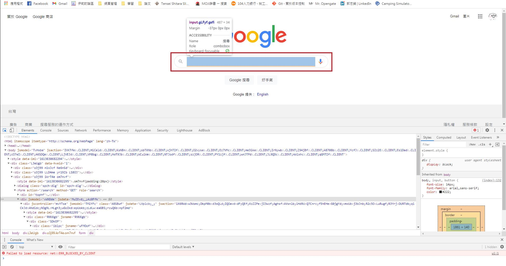

# Selenium (Dynamic [[web crawler]])
Source: <https://reurl.cc/kVXygL>
## 1. Install
 Install selenium 
> `pip install selenium`

## 2. Use webdriver to imitate web search behavior
> `from selenium import webdriver`

In the webdriver, there is a lot of driver can be choose:
	
##### Chromedriver
> # Method 1: Call the function directly 
> `driver = webdriver.Chrome()`
> # Method 2: Call the google chrome in the computer 
> `driver = webdriver.Chrome("Path/chromedriver")`

####  Another explorer
> # Firefox 
> `driver = webdriver.Firefox()`
> # Safari
> `driver = webdriver.Safari()`
	

After setting the explorer, use `get()` to enter the specific website, and we can close the website with `close()`
	
> open the website with `get()`
> `driver.get("https://www.google.com")` 
> close the website with `close()`
> `driver.close()`
	
## 3. Use Selenium to input and click
If we want to crawl the google search result, we want to search the keyword **Selenium Python**, then we need to find the search frame like following image:
	

>  # Spot the search frame 
	> `search = driver.find_element_by_class_name("gLFyf.gsfi")`
	> 
	> # Input the string
	> `search.send_keys("Selenium Python"`)
	>
	> # Clear the search key
	> `search.clear()`
	
## 4. Use Selenium to imitate keyboard input

If you want to sent the letter like keyboard input
> `search.send_keys("c")`

And you want to sent special keys like *F9*, then you need import

> `from selenium.webdriver.common.keys import Keys`
	> 
	> `search.send_keys("\ue039")`  # F9 = '\ue093'

If you want to check the special key codes, check [here](https://www.selenium.dev/selenium/docs/api/py/webdriver/selenium.webdriver.common.keys.html)

If you want to input ***combined keys***
> `search.send_keys(Keys.CONTROL, "c")`

	
